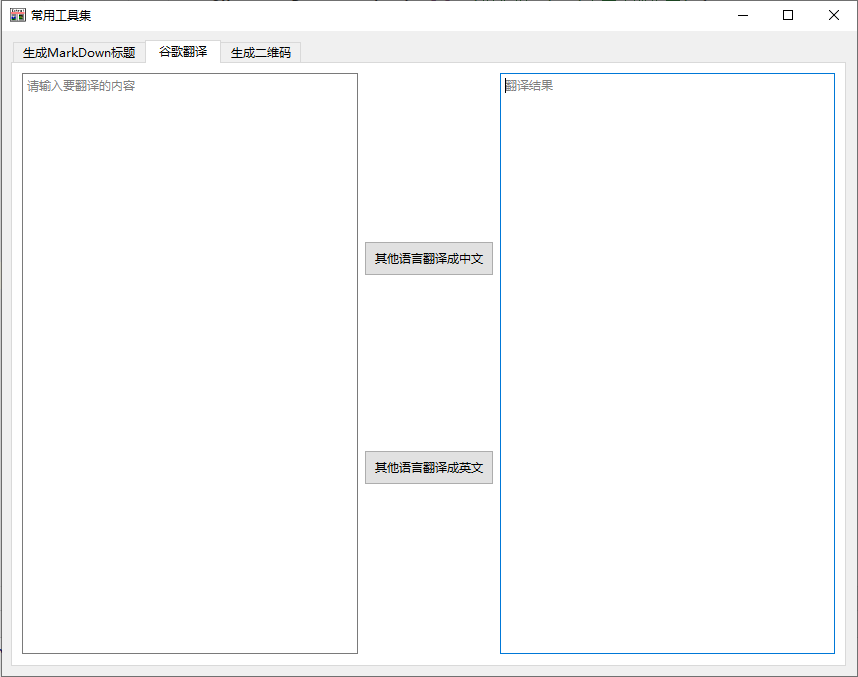

# MdTocPy
基于python写的
带有可视化界面的常用工具集:

1.生成downmark的标题

2.google翻译

3.二维码的生成 

### 安装与运动
- 1.确保电脑上已经安装pipenv
    如果还没有安装，请先安装:
    ```
        pip install pipenv
    ```
- 2.使用pipenv创建虚拟环境
  在cmd窗口里进入到你的项目目录，执行以命令
  ```angular2html
  pipenv --python 3
  ```
- 2.还原所有项目包
    ```angular2html
    pipenv install --dev
    ```
- 3.运行项目

   右键->main.py->run main
- 4.将项目打包成exe
生成单文件程序，并且打开时不打开命令行窗口
  ```
  pyinstaller -F -w -i ui/logo.ico main.py
  ```
  生成多文件程序，并且打开时不打开命令行窗口
  ```
  pyinstaller -D -w -i ui/logo.ico main.py
  ```
- 5.查看结果
  